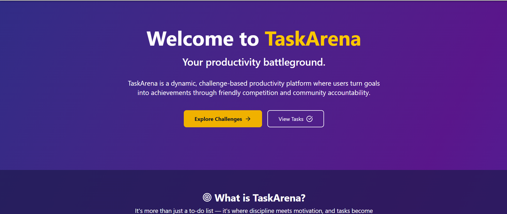
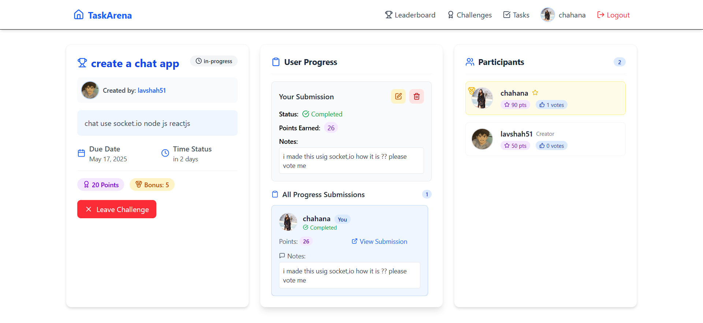
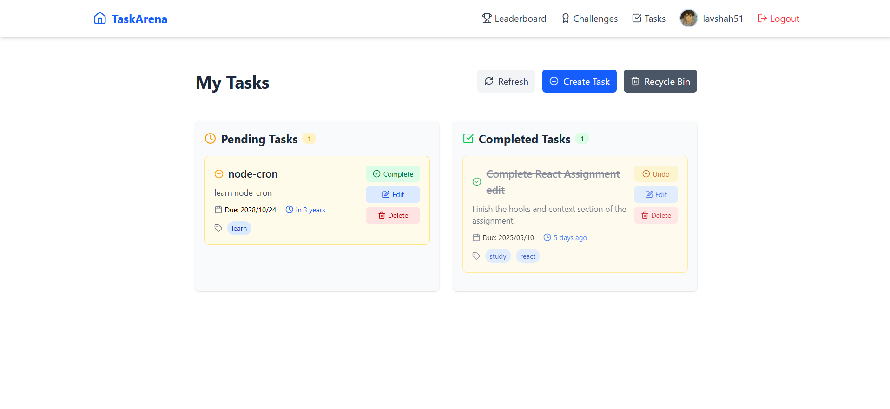

# 🏟️ Task Arena




**Task Arena** is a full-stack productivity web application that combines challenge-based goal tracking with a powerful personal task manager. Whether you're working solo or competing with others, Task Arena helps you stay focused, motivated, and organized — all within a clean and intuitive interface.

---

## 🚀 Key Features

### 🔥 Challenge Arena
- **Create Public Challenges**: Add titles, descriptions, points, and optional bonus points.
- **Join/Leave Anytime**: Participate in challenges freely.
- **Submit Progress**: Track your updates, edit, or delete submissions as needed.
- **Voting System**: Users vote on progress submissions. Each vote = 1 point.
- **Leaderboard & Winner Display**: Automatically declares the winner when a challenge ends.
- **Challenge Editing**: Creators can edit or soft-delete their challenges.
- **Soft Delete & Recovery**: Restore or permanently delete challenges.
- **My Challenges**: View challenges you’ve created or joined.
- **Top Users Leaderboard**: Ranks users based on total points across all challenges.



### ✅ Personal Task Manager
- **Create Detailed Tasks**: Include title, description, due date, priority, and tags.
- **Due Date Lock**: Prevent due date from being edited accidentally.
- **Task Editing**: Update task details anytime.
- **Completion Status**: Toggle between Completed and Pending.
- **Soft Delete with Recycle Bin**: Temporarily remove tasks and recover them later.
- **Permanent Deletion**: Remove tasks completely when no longer needed.
- **Live Countdown Timer**: Track time left until due dates in real-time.
- **Tag-Based Organization**: Use tags for better task management and filtering.


---

## 🛠️ Tech Stack

### Frontend
- **React**
- **Tailwind CSS**
- **React Router**
- **Axios**

### Backend
- **Node.js**
- **Express.js**
- **MongoDB** with **Mongoose**

### Authentication & State
- **JWT (JSON Web Token)**
- **React Context API** for auth state management

### Other Libraries
- **bcrypt** (password hashing)
- **multer** (file uploads)
- **dayjs** (date/time formatting)

---

## 📦 Getting Started

### Clone the Repository
```bash
git clone https://github.com/your-username/task-arena.git
cd task-arena

## Backend Setup
cd backend
npm install
npm run dev

## Frontend Setup
cd frontend
npm install
npm run dev


🔐 Environment Variables
Create a .env file in both backend and frontend directories with the following:

Backend (/backend/.env)

PORT=3000
MONGOOSE_URL=your_mongodb_connection_string
CLOUDINARY_CLOUD_NAME=your_cloudinary_cloud_name
CLOUDINARY_API_KEY=your_cloudinary_api_key
CLOUDINARY_API_SECRET=your_cloudinary_api_secret
JWT_SECRET_KEY=your_jwt_secret_key


Frontend (/frontend/.env)
VITE_API_URL=http://localhost:3000/api

🔐 Authentication & Access Control
All user-specific features (challenges, tasks, voting) require login.

JWT tokens are used to secure API requests.

Auth state is managed globally using React Context.

🏆 Leaderboard Highlights
Shows top 10 users by total challenge points.

Displays username, profile image, and score.

Automatically excludes banned accounts.

🤝 Contributing
Want to help improve Task Arena?

Fork the repository

Submit issues or feature requests

Open a pull request with improvements

All contributions are welcome!

📄 License
This project is licensed under the MIT License.
